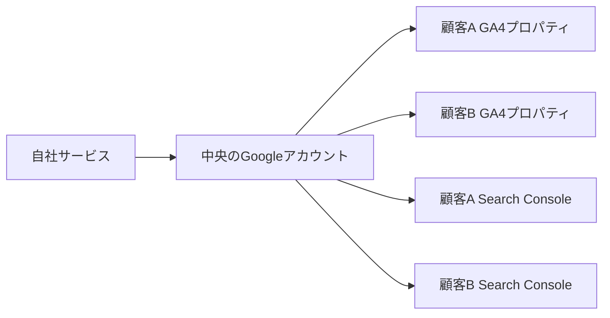
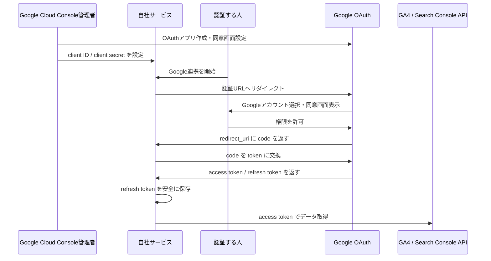
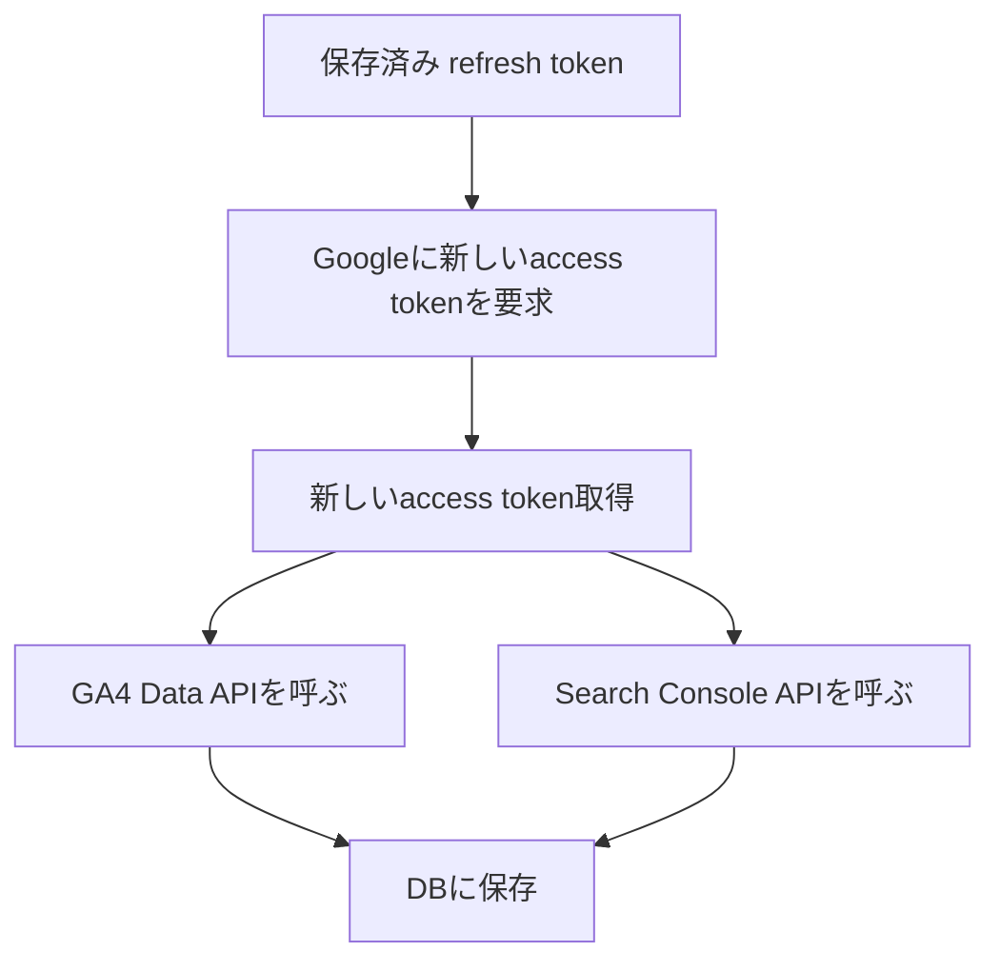

# GA4 / Search Console OAuth 連携の全体像

実装時の詳細仕様は [GA4 / Search Console OAuth連携 実装仕様書](./google-oauth-implementation-spec.md) を参照します。

## 目的

このドキュメントは、Google Analytics 4（GA4）と Google Search Console（サチコ）のデータをサービスで取得するために、Google OAuth の同意画面で認証してもらい、サービス側でトークンを取得・保存するまでの流れを説明するものです。

主な読者は、Google Cloud Console や OAuth に詳しくない担当者です。

この連携でやりたいことは次の通りです。

- GA4 のデータを取得する
- Search Console のデータを取得する
- Google Cloud Console で作成した OAuth アプリを通して認証する
- 非エンジニアでも迷わず同意できる状態にする
- 同意後にサービス側で refresh token を取得し、継続的にデータ取得できるようにする

## 重要な結論

Google Cloud Console だけでは完結しません。

Google Cloud Console は、Google に対して「このアプリはこういう名前で、こういう権限を求めます」と登録する場所です。一方で、同意後に返ってくる認可コードを受け取り、トークンに交換し、保存し、APIを呼ぶ処理はサービス側に必要です。

役割は次のように分かれます。

| 領域 | やること |
| --- | --- |
| Google Cloud Console | OAuthアプリ作成、同意画面設定、API有効化、client ID / client secret 発行 |
| Googleの同意画面 | 認証する人がGoogleアカウントを選び、権限を許可する |
| 自社サービス | 認証URL生成、認可コード受け取り、トークン交換、refresh token保存、APIデータ取得 |

## 関係者

| 関係者 | 役割 |
| --- | --- |
| 認証する人 | Googleの同意画面で「許可」する人。社内担当者や管理アカウントの保有者 |
| Google Cloud Console 管理者 | OAuthアプリ、同意画面、API、認証情報を設定する人 |
| 開発者 | 認証URL、callback URL、トークン取得、API取得処理を実装する人 |
| 運用担当者 | 接続済みアカウント、権限切れ、再認証、取得状況を確認する人 |
| 顧客 | GA4 / Search Console のプロパティ所有者。必要に応じて中央アカウントへ権限付与する |

## アカウントと権限の考え方

「1つのGoogleアカウントに複数顧客のデータがつながっている」という表現は、おおむね正しいです。ただし厳密には、Googleアカウントそのものにデータが入っているわけではありません。

正しくは、Googleアカウントが複数のGA4プロパティやSearch Consoleプロパティにアクセス権を持っています。



OAuthで中央のGoogleアカウントを認証すると、自社サービスはそのアカウントが見られる範囲だけ取得できます。

取得できない代表例は次の通りです。

- 中央アカウントにGA4権限がない
- 中央アカウントにSearch Console権限がない
- 顧客側で権限を外した
- Google Workspace側で外部アプリ利用が制限されている

## 取得対象のAPI

今回使うAPIは主に3つです。

| API | 用途 |
| --- | --- |
| Google Analytics Data API | GA4のレポートデータ取得 |
| Google Analytics Admin API | GA4アカウント、プロパティ一覧などの管理情報取得 |
| Google Search Console API | サチコの検索パフォーマンスデータ取得 |

## 最初に使うスコープ

読み取り専用で始めるのが安全です。

```text
https://www.googleapis.com/auth/analytics.readonly
https://www.googleapis.com/auth/webmasters.readonly
```

これにより、GA4とSearch Consoleのデータを読む権限だけを要求します。設定変更や削除はできません。

非エンジニア向けには、次のように説明できます。

```text
この連携では、Google Analytics 4 と Search Console の分析データを読み取る権限だけを許可します。
設定変更、削除、投稿などの操作は行いません。
```

## 全体フロー



## 同意からトークン取得までの流れ

### 1. Google Cloud ConsoleでOAuthアプリを作る

Google Cloud Consoleでプロジェクトを作成し、OAuthアプリを設定します。

設定する主な項目は次の通りです。

- アプリ名
- サポートメール
- ロゴ
- 承認済みドメイン
- プライバシーポリシーURL
- 利用規約URL
- 必要なスコープ
- 公開状態
- OAuthクライアントID
- redirect URI

### 2. APIを有効化する

Google Cloud Consoleで次のAPIを有効化します。

- Google Analytics Data API
- Google Analytics Admin API
- Google Search Console API

### 3. OAuthクライアントを作る

OAuthクライアントの種類は、通常は `Web application` です。

ここで発行されるものが、サービス側で必要になります。

```text
client_id
client_secret
```

また、認証後にGoogleから戻ってくるURLを `redirect URI` として登録します。

例:

```text
https://example.com/oauth/google/callback
```

### 4. サービス側で認証URLを作る

サービス側は、Googleの認証URLを作ります。

主なパラメータは次の通りです。

| パラメータ | 意味 |
| --- | --- |
| client_id | Google Cloud Consoleで発行したID |
| redirect_uri | 認証後に戻ってくるURL |
| response_type | `code` を指定 |
| scope | 取得したい権限 |
| access_type | `offline` を指定 |
| prompt | 必要に応じて `consent` を指定 |
| state | CSRF対策や接続対象識別に使うランダム値 |

`access_type=offline` が重要です。これがないと、継続取得に必要な refresh token が取れない可能性があります。

### 5. 認証する人がGoogle同意画面で許可する

認証する人はGoogleの画面で次の内容を確認します。

- 正しいGoogleアカウントでログインしているか
- アプリ名が想定通りか
- サポートメールやドメインが正しいか
- 要求される権限が読み取り専用か

認証する人向けの案内文は、次のようにできます。

```text
Google Analytics 4 と Search Console のデータ取得のため、Google連携をお願いします。

表示されるGoogleの同意画面で、アプリ名が「〇〇社 GA4・Search Console連携」になっていることを確認し、許可してください。

この連携では読み取り専用の権限のみを使用します。
設定変更、削除、投稿などの操作は行いません。
```

### 6. Googleがサービスに認可コードを返す

同意が完了すると、Googleは登録済みの `redirect_uri` に戻します。

例:

```text
https://example.com/oauth/google/callback?code=xxxx&state=yyyy
```

この `code` は認可コードです。まだAPI取得に使えるトークンではありません。

### 7. サービス側でcodeをトークンに交換する

サービス側は、認可コードをGoogleのトークンエンドポイントに送ります。

```text
POST https://oauth2.googleapis.com/token
```

送る主な値は次の通りです。

```text
client_id
client_secret
code
redirect_uri
grant_type=authorization_code
```

成功すると、Googleから次のような情報が返ります。

```json
{
  "access_token": "...",
  "expires_in": 3599,
  "refresh_token": "...",
  "scope": "https://www.googleapis.com/auth/analytics.readonly https://www.googleapis.com/auth/webmasters.readonly",
  "token_type": "Bearer"
}
```

### 8. refresh tokenを保存する

`refresh_token` は長期的なデータ取得に必要です。

取り扱いはパスワード相当として考えます。

- DBに保存する
- 暗号化して保存する
- 表示画面に出さない
- ログに出さない
- 削除・再認証できるようにする

保存対象は次のように分けます。

| 対象 | 保存方針 | 理由 |
| --- | --- | --- |
| 認可コード | 保存しない | 短時間だけ使う使い捨ての値であり、token交換後は不要 |
| access token | 原則保存しない | 短命であり、必要時にrefresh tokenから再発行できる |
| refresh token | 暗号化して保存する | 継続取得に必要であり、漏えい時の影響が大きい |

Supabaseなどの永続ストアには、平文の `refresh_token` ではなく、バックエンドで暗号化した値だけを保存します。

```text
Googleからrefresh_token取得
  ↓
バックエンドで暗号化
  ↓
encrypted_refresh_tokenをSupabaseに保存
  ↓
利用時にバックエンドで復号
  ↓
Google API呼び出し
```

初期実装では、Pythonの `cryptography` ライブラリが提供する `Fernet` を使う方針とします。

`Fernet` は共通鍵暗号方式です。同じ鍵で暗号化と復号を行います。鍵は `TOKEN_ENCRYPTION_KEY` のような環境変数で管理し、Supabaseには保存しません。

公開鍵暗号も選択肢になりますが、今回の構成では同じバックエンドがトークンを受け取り、保存し、後で復号してGoogle APIを呼びます。そのため、バックエンドは結局復号用の秘密情報を持つ必要があります。初期実装では公開鍵暗号で構成を複雑にするより、Fernetで暗号化処理を小さく閉じ込め、将来必要になったらKMSへ差し替えやすい形にします。

将来、本番運用や監査要件が強くなった場合は、Google Cloud KMSやAWS KMSなどの鍵管理サービスへの移行を検討します。

## セキュリティ方針

Google OAuthを使うことで、Googleアカウントの本人認証はGoogleに任せられます。一方で、同意後に取得したトークンの管理は自社サービス側の責任です。

この連携で特に守るべきものは、Googleアカウントのパスワードではなく、GA4 / Search Consoleへ継続アクセスできる `refresh_token` です。

最低限守る方針は次の通りです。

- `state` を必ず生成し、callback時に検証する
- `redirect_uri` はGoogle Cloud Consoleで厳密に登録する
- 本番運用ではHTTPSを前提にする
- `client_secret` と `TOKEN_ENCRYPTION_KEY` は環境変数で管理する
- `client_secret`、暗号化キー、平文トークンをフロントエンドに渡さない
- `code`、`access_token`、`refresh_token`、`client_secret`、暗号化キーをログに出さない
- Supabaseには暗号化済み `refresh_token` だけを保存する
- Supabaseのservice role keyをフロントエンドに出さない
- トークン保存テーブルはフロントエンドから直接読めないようにする
- スコープは読み取り専用に限定する
- 接続解除、再認証、権限不足、期限切れを判別できるようにする

主なリスクと対策は次の通りです。

| リスク | 対策 |
| --- | --- |
| 認可コードを不正利用される | callbackで受け取ったらすぐtoken交換し、保存しない |
| 別の接続に紐づいてしまう | `state` を発行・保存・検証する |
| refresh tokenが漏れる | 平文保存せず、バックエンドで暗号化して保存する |
| 暗号化済みtokenと鍵が両方漏れる | DBと暗号化キーを分離し、鍵は環境変数や将来KMSで管理する |
| ログからtokenが漏れる | token、code、secretをログ出力しない |
| フロントエンドから秘密情報が漏れる | token交換、暗号化、Supabase保存はバックエンドに集約する |
| Supabase権限設定ミスでtokenテーブルが読まれる | フロントから直接読ませず、必要な操作はバックエンド経由にする |

フロントエンドを用意する場合でも、フロントエンドの役割はGoogle連携の開始操作に限定します。認証URL生成、`state` 管理、token交換、暗号化、保存はバックエンド側で行います。

バックエンドだけをサーバに上げて使う場合も、バックエンドのOAuth開始URLにアクセスすればGoogle同意画面へ進める構成にします。

### 9. APIデータを取得する

`access_token` を使ってGA4 / Search Console APIを呼びます。

`access_token` は短時間で期限切れになります。期限切れ後は、保存済みの `refresh_token` を使って新しい `access_token` を取得します。



## OAuthアプリの公開状態

ここは運用上かなり重要です。

| 状態 | 特徴 |
| --- | --- |
| Testing | テストユーザーだけが利用可能。認可は7日で期限切れ。refresh tokenも期限切れになる |
| In production | 本番利用向け。Googleアカウントで利用可能。ただしスコープによって審査や未確認アプリ表示が関係する |
| Internal | 自社Google Workspace / Cloud Identity組織内だけで使う設定。社内ツールなら最有力 |

社内ツールで、認証するGoogleアカウントが自社Workspace内にあるなら、まず `Internal` を検討します。

個人Gmailや社外アカウントでも認証するなら、`External` が必要です。その場合、`In production` やGoogleの確認・審査が関係します。

## Testing状態の注意点

OAuthアプリが `Testing` のままだと、次の問題があります。

- テストユーザーに登録したアカウントしか認証できない
- 100ユーザーまでの制限がある
- 同意画面に警告が出る
- 認可が7日で期限切れになる
- offline accessで取得した refresh token も7日で期限切れになる

検証だけなら問題ありませんが、継続運用には向きません。

## 取得できるデータの考え方

「取れそうなものは全部ほしい」という場合でも、1回のAPIで全部取得する形にはなりません。

GA4は、ディメンションと指標の組み合わせに互換性があります。ページ別、日別、流入元別、イベント別など、用途ごとに分けて取得します。

Search Consoleも、クエリ別、ページ別、デバイス別、国別などで分けて取得します。

最初に作る取得単位の例です。

| データ | 粒度 |
| --- | --- |
| GA4日別サマリー | 日付 x プロパティ |
| GA4ページ別 | 日付 x ページ |
| GA4流入元別 | 日付 x source / medium |
| GA4イベント別 | 日付 x eventName |
| Search Consoleクエリ別 | 日付 x query |
| Search Consoleページ別 | 日付 x page |
| Search Consoleクエリ x ページ別 | 日付 x query x page |

## 非エンジニアが見るべきチェックポイント

同意してもらう担当者は、次を確認します。

- 正しいGoogleアカウントでログインしている
- アプリ名が社内で案内された名前と一致している
- サポートメールが社内のメールになっている
- 要求権限が読み取り専用になっている
- 同意後にサービス側で「接続完了」になっている

## 開発側で必要なもの

同意後にトークンを取得するため、サービス側には次が必要です。

- Google認証URLを生成する処理
- `redirect_uri` でGoogleからのcallbackを受ける処理
- `code` と `state` を検証する処理
- `code` を `access_token` / `refresh_token` に交換する処理
- `refresh_token` を暗号化保存する処理
- トークン期限切れ時に再発行する処理
- GA4 / Search Console APIを呼ぶ処理
- 権限不足や期限切れを画面に出す処理

## 推奨する初期実装ステップ

最初からすべてのデータ取得を作るより、接続確認を優先します。

1. Google Cloud ConsoleでOAuthアプリを作る
2. 必要APIを有効化する
3. 読み取り専用スコープを設定する
4. OAuthクライアントIDを作る
5. サービス側で認証URLを作る
6. Google同意画面で許可する
7. callbackで `code` を受け取る
8. `code` をトークンに交換する
9. refresh tokenを保存する
10. GA4プロパティ一覧を取得する
11. Search Consoleプロパティ一覧を取得する
12. 1つのプロパティで日別データ取得を試す
13. 複数顧客・複数プロパティに広げる

## よくあるトラブル

| 状況 | 原因の例 | 対応 |
| --- | --- | --- |
| 7日後に取得できなくなる | OAuthアプリがTesting状態 | InternalまたはIn productionを検討 |
| refresh tokenが返らない | `access_type=offline` がない、既に同意済み | `access_type=offline` と必要に応じて `prompt=consent` を使う |
| GA4プロパティが出ない | 認証アカウントにGA4権限がない | GA4側で権限付与 |
| Search Consoleプロパティが出ない | 認証アカウントにサチコ権限がない | Search Console側で権限付与 |
| 同意画面に警告が出る | 未確認アプリ、Testing、審査未完了 | Internal / In production / OAuth審査を確認 |
| 非エンジニアが不安になる | アプリ名・ロゴ・メールが不明瞭 | 同意画面の表示情報と事前案内を整える |

## 最低限の完成条件

まずは次の状態を目指します。

- Google同意画面で迷わず許可できる
- 同意後にサービス側で refresh token を保存できる
- GA4プロパティ一覧が取得できる
- Search Consoleプロパティ一覧が取得できる
- 1つのプロパティでデータ取得できる
- 期限切れ、権限不足、再認証が判別できる

## 参考リンク

- [Google OAuth App Audience / Publishing status](https://support.google.com/cloud/answer/15549945?hl=en)
- [OAuth verification が不要なケース](https://support.google.com/cloud/answer/13464323?hl=en)
- [Sensitive scope verification](https://developers.google.com/identity/protocols/oauth2/production-readiness/sensitive-scope-verification)
- [OAuth 2.0 for Web Server Applications](https://developers.google.com/identity/protocols/oauth2/web-server)
- [GA4 Data API dimensions and metrics](https://developers.google.com/analytics/devguides/reporting/data/v1/api-schema)
- [Google Analytics Admin API](https://developers.google.com/analytics/devguides/config/admin/v1)
- [Search Console API authorization](https://developers.google.com/webmaster-tools/v1/how-tos/authorizing?hl=ja)
- [Search Analytics query](https://developers.google.com/webmaster-tools/v1/searchanalytics/query)
- [Search Console API export limits](https://support.google.com/webmasters/answer/12919192?hl=en)
